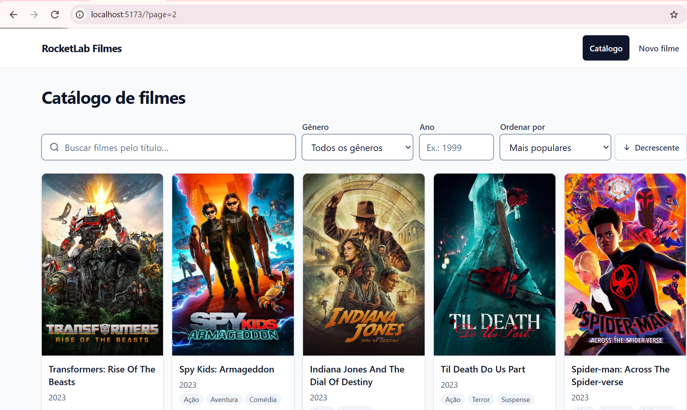
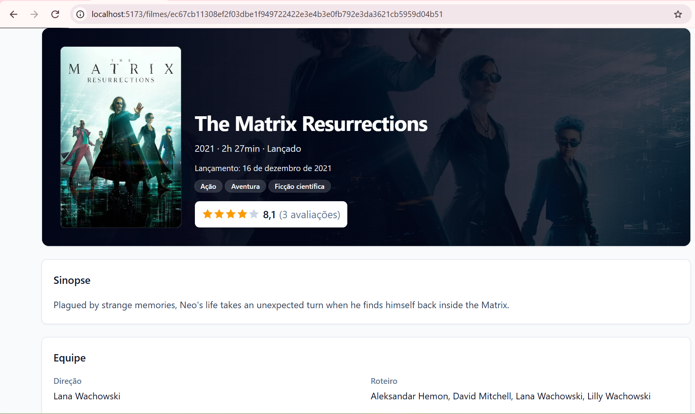
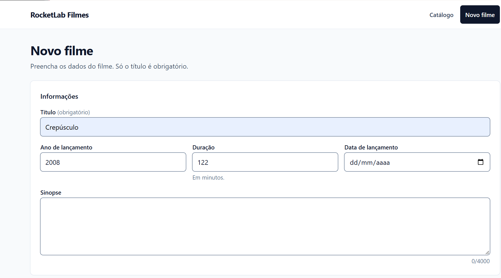
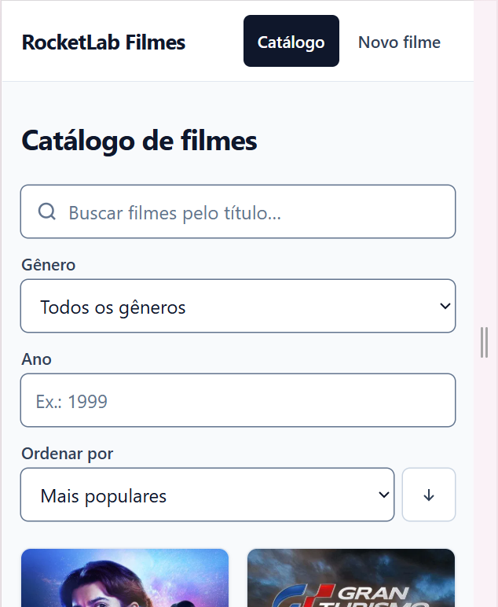

# RocketLab Filmes

[](https://github.com/AimeGuimaraes/dev_rocketlab/actions/workflows/ci.yml)

Sistema de avaliação de filmes inspirado no Letterboxd, desenvolvido para o **Rocket Lab 2026
— Visagio**. O catálogo tem cerca de 95 mil filmes carregados a partir de CSVs. É possível buscar,
filtrar, cadastrar, editar e remover filmes e publicar avaliações com nota de 0 a 10 e resenha.
A API é FastAPI com SQLite e o frontend é React com TypeScript.

## Sumário

- [Funcionalidades](#funcionalidades)
- [Telas](#telas)
- [Pré-requisitos](#pré-requisitos)
- [Como rodar](#como-rodar)
- [Stack](#stack)
- [Arquitetura](#arquitetura)
- [Decisões técnicas](#decisões-técnicas)
- [Testes e qualidade](#testes-e-qualidade)
- [Estrutura de pastas](#estrutura-de-pastas)
- [Limitações conhecidas](#limitações-conhecidas)

## Funcionalidades

### Requisitos da atividade

- [x] Cadastrar filmes com título, diretor(es), ano, gênero(s) e sinopse.
- [x] Catálogo paginado.
- [x] Página de detalhes com todos os dados do filme e a lista de avaliações.
- [x] Busca de um ou mais filmes pelo título.
- [x] Edição e remoção de filmes (a remoção pede confirmação).
- [x] Nova avaliação com nota de **0 a 10** e resenha.
- [x] Média geral das avaliações de cada filme, no catálogo e no detalhe.

### Extras

- [x] Filtros por gênero e por ano de lançamento, combináveis com a busca.
- [x] Ordenação por popularidade, título, ano ou nota média, em ordem crescente ou decrescente.
- [x] Estado da busca na URL (`?q=&genre_id=&year=&sort=&order=&page=`): voltar, recarregar e
      compartilhar o link mantêm a busca.
- [x] Testes automatizados no backend (pytest) e no frontend (Vitest + Testing Library + MSW).
- [x] Integração contínua no GitHub Actions: lint, formatação, testes, build e verificação do
      contrato da API.
- [x] Acessibilidade: link "Pular para o conteúdo", foco visível, `label` em todos os campos,
      `alt` nos pôsteres, erros ligados aos campos por `aria-describedby`, modal de confirmação
      navegável por teclado e respeito a `prefers-reduced-motion`.
- [x] Layout responsivo, revisado em 360 px, 768 px e desktop.
- [x] Cache com TanStack Query: as consultas são reaproveitadas entre as telas e cada mutation
      invalida só as consultas afetadas.
- [x] Code-splitting por rota: cada página é um chunk carregado sob demanda.
- [x] Os quatro estados em todas as telas: carregando (skeleton), erro, vazio e sucesso.

## Telas

| Catálogo | Detalhe do filme |
|---|---|
|  |  |

| Formulário de cadastro | Versão mobile |
|---|---|
|  |  |

## Pré-requisitos

- **Python 3.11+** (testado com 3.14)
- **Node.js 20.19+** (testado com 24), com npm
- **Git**
- Os **10 CSVs de dados**, fornecidos separadamente junto com a atividade (não são versionados)

## Como rodar

Clone o repositório:

```bash
git clone https://github.com/AimeGuimaraes/dev_rocketlab.git
cd dev_rocketlab
```

O backend e o frontend rodam em dois terminais separados.

### 1. Backend

Rode todos os comandos do backend **a partir da pasta `backend/`**. O caminho do banco
(`./rocketlab.db`) e o `.env` são relativos à pasta atual: rodando de outro lugar, a API
usaria outro banco, vazio.

**Windows (PowerShell)**

```powershell
cd backend
python -m venv .venv
.venv\Scripts\pip install -e ".[dev]"
copy .env.example .env
.venv\Scripts\alembic upgrade head        # cria o banco rocketlab.db com o schema
```

**Linux / macOS**

```bash
cd backend
python3 -m venv .venv
.venv/bin/pip install -e ".[dev]"
cp .env.example .env
.venv/bin/alembic upgrade head            # cria o banco rocketlab.db com o schema
```

#### Carga dos dados (seed)

Copie os 10 CSVs para `backend/data/`, com os nomes exatos:

```text
bridge_movie_company.csv   dim_companies.csv   dim_people.csv    fact_movies_performance.csv
bridge_movie_genre.csv     dim_genres.csv      dim_reviews.csv   movies_reviews.csv
bridge_movie_person.csv    dim_movies.csv
```

Depois rode o seed (ainda em `backend/`):

```powershell
.venv\Scripts\python -m app.cli.seed      # Windows
```

```bash
.venv/bin/python -m app.cli.seed          # Linux / macOS
```

A carga leva **de 4 a 5 minutos** (varia com a máquina), insere cerca de 1,7 milhão de linhas e
registra no log a contagem de cada tabela e o tempo total. Ela é idempotente: se o banco já tiver dados, avisa e sai sem alterar nada. Para apagar
tudo e recarregar, use `python -m app.cli.seed --reset`. Com `--data-dir CAMINHO`, os CSVs são
lidos de outra pasta.

O formato de cada arquivo, as contagens esperadas e as divergências entre os CSVs e os modelos
estão em [backend/data/README.md](backend/data/README.md).

#### Subir a API

```powershell
.venv\Scripts\uvicorn app.main:app --reload     # Windows
```

```bash
.venv/bin/uvicorn app.main:app --reload         # Linux / macOS
```

### 2. Frontend

Em outro terminal, a partir da raiz do repositório:

**Windows (PowerShell)**

```powershell
cd frontend
copy .env.example .env      # VITE_API_URL=http://localhost:8000/api/v1
npm ci
npm run dev
```

**Linux / macOS**

```bash
cd frontend
cp .env.example .env        # VITE_API_URL=http://localhost:8000/api/v1
npm ci
npm run dev
```

No npm 11, o `npm ci` pode avisar que o script de `postinstall` do `msw` não foi executado
(`install-scripts`). O aviso é inofensivo: esse script só copia um service worker para uso no
navegador, e os testes rodam o MSW em Node.

### 3. Endereços

| O quê | URL |
|---|---|
| Aplicação | http://localhost:5173 |
| API | http://localhost:8000/api/v1 |
| Documentação interativa (Swagger) | http://localhost:8000/docs |
| Health check | http://localhost:8000/health |

O CORS da API aceita `http://localhost:5173` por padrão (`BACKEND_CORS_ORIGINS` no
`backend/.env`). Se a porta 8000 estiver ocupada, suba a API com `--port 8010` (por exemplo) e
ajuste `VITE_API_URL` no `frontend/.env` para `http://localhost:8010/api/v1`. Reinicie o
`npm run dev` depois de mudar o `.env`.

## Stack

**Backend** (`backend/pyproject.toml`)

| Pacote | Versão testada |
|---|---|
| Python | 3.14 (mínimo 3.11) |
| FastAPI | 0.141 |
| Uvicorn | 0.54 |
| SQLAlchemy (async) + aiosqlite | 2.1 + 0.22 |
| Alembic | 1.20 |
| Pydantic + pydantic-settings | 2.13 + 2.15 |
| SQLite | banco de dados (arquivo local) |
| pytest + pytest-asyncio + pytest-cov + httpx | 9.1 |
| Ruff (lint e formatação) | 0.16 |

**Frontend** (`frontend/package.json`)

| Pacote | Versão |
|---|---|
| React | 19.2 |
| TypeScript | 6.0 |
| Vite | 8 |
| React Router | 8 |
| TanStack Query | 5 |
| react-hook-form + zod | 7 + 4 |
| Tailwind CSS | 4 |
| openapi-typescript + openapi-fetch | 7 + 0.17 |
| Vitest + Testing Library + MSW | 5 + 16 + 2 |
| ESLint + Prettier | 10 + 3 |

## Arquitetura

```text
React (Vite) ──HTTP/JSON──▶ FastAPI /api/v1 ──▶ service ──▶ repository ──▶ SQLite
   TanStack Query                router                    SQLAlchemy async
   tipos do OpenAPI
```

### Backend

O código fica em `backend/app/`, com um pacote por domínio (`movies/`, `reviews/`, `genres/`).
Cada pacote se divide em quatro camadas:

- **`router.py`**: endpoints HTTP finos. Validam a entrada com Pydantic e delegam ao service.
- **`service.py`**: regras de negócio. Faz o get-or-create de diretores, gera o `id_filme`,
  recalcula o resumo de avaliações e controla a transação.
- **`repository.py`**: consultas SQLAlchemy. Usa `selectinload` para carregar os
  relacionamentos sem N+1, e a listagem não carrega o elenco.
- **`schemas.py`**: schemas Pydantic separados por uso, como `MovieCreate`, `MovieUpdate`
  (todos os campos opcionais, para PATCH), `MovieListItem` (enxuto, para o catálogo) e
  `MovieDetail` (completo).

Outras partes:

- **Erros.** Os services lançam erros de domínio (`NotFoundError`, `InvalidReferenceError`
  em `app/core/errors.py`). O módulo `app/core/exception_handlers.py` converte esses erros, os
  de validação e os HTTP no formato único `ErrorResponse`: `404` para recurso inexistente e
  `422` para validação, com mensagens em pt-BR por campo. Um middleware devolve `500` no mesmo
  formato, dentro do CORS, para o navegador conseguir ler o erro.
- **Banco.** O schema é criado e evoluído só pelo Alembic (`migrations/`), e a aplicação nunca
  chama `create_all`. Toda conexão liga `PRAGMA foreign_keys=ON`, e as FKs usam
  `ondelete="CASCADE"`. Assim, remover um filme apaga as ligações, a performance, o resumo e
  as avaliações dele, mas não apaga pessoas, gêneros nem produtoras.
- **Modelo de dados.** É um esquema estrela: dimensões (`dim_movies`, `dim_genres`,
  `dim_people`, `dim_companies`, `dim_reviews`), fato (`fact_movies_performance`), pontes N:N
  (`bridge_movie_genre`, `bridge_movie_person`, `bridge_movie_company`) e `movie_reviews` com as
  avaliações individuais. As chaves `sk_*` são hashes SHA-256.
- **Seed.** O módulo `app/cli/seed.py` lê os CSVs em streaming e insere em lotes de 5.000
  linhas numa única transação. O maior arquivo tem cerca de 95 MB.

### Contrato da API (`/api/v1`)

| Método | Rota | Descrição | Sucesso |
|---|---|---|---|
| GET | `/movies` | Catálogo paginado com busca, filtros e ordenação | `200` |
| GET | `/movies/{sk_movie_id}` | Detalhe completo (gêneros, pessoas, produtoras, performance, média) | `200` |
| POST | `/movies` | Cadastrar filme | `201` |
| PATCH | `/movies/{sk_movie_id}` | Atualização parcial (só os campos enviados) | `200` |
| DELETE | `/movies/{sk_movie_id}` | Remover filme | `204` |
| GET | `/movies/{sk_movie_id}/reviews` | Avaliações paginadas, das mais recentes para as mais antigas | `200` |
| POST | `/movies/{sk_movie_id}/reviews` | Nova avaliação; devolve a nova média e a quantidade | `201` |
| GET | `/genres` | Gêneros em ordem alfabética (para filtro e formulário) | `200` |
| GET | `/health` *(fora do prefixo)* | Status da API | `200` |

Parâmetros de `GET /movies`:

| Parâmetro | Descrição |
|---|---|
| `page` | Página, começando em 1 (padrão 1) |
| `page_size` | Itens por página, de 1 a 100 (padrão 20) |
| `q` | Trecho do título, sem diferenciar maiúsculas de minúsculas (até 200 caracteres) |
| `genre_id` | `sk_genre_id` do gênero |
| `year` | Ano de lançamento (1800–2100) |
| `sort` | `popularidade` (padrão), `titulo`, `ano_lancamento` ou `nota_media` |
| `order` | `asc` ou `desc`. O padrão é `desc`, exceto para `titulo` (`asc`) |

`GET /movies/{id}/reviews` aceita `page` e `page_size` (padrão 10, máximo 100). A
documentação completa, com exemplos, fica em http://localhost:8000/docs.

**Resposta paginada** (catálogo e avaliações):

```json
{
  "items": [],
  "total": 95645,
  "page": 1,
  "page_size": 20,
  "pages": 4783
}
```

**Resposta de erro** (`ErrorResponse`, igual para todos os status de erro):

```json
{
  "detail": "Dados inválidos.",
  "errors": [{ "field": "nota", "message": "Deve ser menor ou igual a 10." }]
}
```

Quando o erro não se refere a um campo, `errors` vem `null`, como em
`{"detail": "Filme não encontrado.", "errors": null}`.

### Frontend

O código fica em `frontend/src/`:

| Pasta | Conteúdo |
|---|---|
| `pages/` | Uma página por rota: `/` (catálogo), `/filmes/novo`, `/filmes/:id`, `/filmes/:id/editar` e 404 |
| `components/` | Componentes compartilhados (`MovieCard`, `SearchBar`, `CatalogFilters`, `Pagination`, `RatingDisplay`…), com as subpastas `movie-detail/` e `movie-form/` |
| `api/` | `schema.d.ts` (tipos gerados do OpenAPI), `client.ts` (openapi-fetch tipado), `errors.ts` e `hooks/`, com as queries e mutations do TanStack Query e as chaves de cache |
| `hooks/` | Hooks de UI: debounce dos campos ligados à URL, título da página e mensagens flash |
| `lib/` | Schemas zod dos formulários, formatação pt-BR, leitura e escrita dos parâmetros do catálogo, cliente do Query e configuração de ambiente |
| `test/` | Infraestrutura de testes: servidor MSW, handlers, fixtures tipadas e `renderWithProviders` |

As rotas ficam em `src/router.tsx`, e cada página é carregada com `lazy` (code-splitting). Os
formulários usam react-hook-form com zod, e os erros `422` da API aparecem no campo
correspondente.

## Decisões técnicas

- **Notas de 0 a 10 em todas as camadas.** O banco (com check constraint), o CSV, a API e a
  interface usam a mesma escala. Na tela, a nota aparece como número (ex.: `8,4/10`) ao lado
  de 5 estrelas com meia estrela, que servem só de apoio visual. Converter entre escalas geraria
  arredondamentos e confusão.
- **`dim_reviews` é recalculado a partir de `movie_reviews`.** O `dim_reviews.csv` não bate
  com as avaliações: tem milhares de quantidades divergentes, resumos sem avaliação e filmes
  avaliados sem resumo. Por isso ele não é importado. O seed gera o resumo (quantidade e média)
  a partir de `movie_reviews`, e cada nova avaliação recalcula o resumo do filme **na mesma
  transação**. Assim o catálogo lista a média sem agregar a cada página, e ela sempre bate com
  as avaliações.
- **Diretores são uma lista.** Nos dados, 9.380 filmes têm mais de um diretor, então a API
  recebe e devolve `diretores: string[]`. O diretor não é coluna de `dim_movies`: é uma linha de
  `dim_people` com `tipo_pessoa = 'Diretor'`, ligada por `bridge_movie_person`. No cadastro,
  cada nome é buscado pelo par (nome, tipo) e criado se não existir (*get-or-create*), sem
  duplicar pessoas.
- **O seed carrega os dados como estão.** Limpeza e normalização dos CSVs ficam fora do escopo.
  O seed só converte tipos: vazio vira nulo, datas ISO viram `date`, valores monetários viram
  `Decimal` e inteiros vindos como float (`2375.0`) viram `int`. O que isso deixa passar está em
  [Limitações conhecidas](#limitações-conhecidas).
- **Filmes cadastrados pela aplicação não têm performance.** Orçamento, receita, popularidade
  e notas TMDB/IMDb vêm da base de dados e não fazem parte do formulário. O detalhe mostra a
  seção de performance só quando ela existe. O `id_filme`, obrigatório e único, é gerado pelo
  backend (`app-<uuid curto>`).
- **O PATCH leva só os campos alterados.** O formulário de edição usa os `dirtyFields` do
  react-hook-form e envia apenas o que mudou. Um campo opcional esvaziado vai como `null` para
  ser limpo, e `diretores` e `genre_ids`, quando enviados, substituem a lista inteira. Isso
  evita sobrescrever dados que o usuário não tocou.
- **`created_at` em UTC com sufixo `Z`.** O SQLite grava datas sem fuso. A API trata esses
  valores como UTC e serializa com fuso explícito (ex.: `2026-09-26T22:01:47Z`), para o
  navegador converter para o horário local sem ambiguidade.
- **Tipos do frontend gerados do OpenAPI, com verificação no CI.** O `src/api/schema.d.ts` é
  gerado com `openapi-typescript` a partir do schema do FastAPI, e o `openapi-fetch` usa esses
  tipos nas chamadas. Uma mudança no contrato que quebre o frontend aparece como erro de
  compilação. O job `contrato` do CI gera o OpenAPI direto do app, regenera o arquivo e falha se
  a versão commitada estiver desatualizada.
- **Ajustes mínimos no repositório base.** Os modelos, a migração inicial e a configuração da
  base foram mantidos. Só duas mudanças foram necessárias:
  - No `pyproject.toml`, a dependência passou a ser `sqlalchemy[asyncio]`. O modo async do
    SQLAlchemy precisa do `greenlet`, que nem sempre é instalado sem esse extra, e sem ele a
    API falha ao acessar o banco. Também foi adicionado o `pytest-cov`.
  - No `main.py`, entrou o registro dos handlers de erro (antes do CORS) e as tags e a
    descrição do OpenAPI. O restante do arquivo segue igual.
- **`overrides` do openapi-typescript para TypeScript 6.** O projeto usa TypeScript 6, mas o
  `openapi-typescript` 7 declara `typescript@^5` como peer dependency. O `overrides` no
  `package.json` faz ele usar a versão do projeto, e o `npm ci` instala sem conflito.
- **Sem `eslint-plugin-jsx-a11y`.** O plugin ainda não é compatível com ESLint 10. Em vez
  dele, a acessibilidade foi revisada manualmente, e os testes buscam os elementos por papel e
  por label (`getByRole`, `getByLabelText`), o que falha se um controle não tiver nome
  acessível.

## Testes e qualidade

### Comandos

**Backend** (em `backend/`; no Linux/macOS, troque `.venv\Scripts\` por `.venv/bin/`):

```powershell
.venv\Scripts\pytest --cov            # testes + cobertura
.venv\Scripts\ruff check .            # lint
.venv\Scripts\ruff format --check .   # formatação
```

**Frontend** (em `frontend/`):

```bash
npm test                 # testes (Vitest, execução única)
npm run test:coverage    # testes + cobertura (relatório HTML em coverage/)
npm run lint             # ESLint
npm run format:check     # Prettier
npm run build            # checagem de tipos (tsc) + build de produção
```

Os testes do backend usam um SQLite temporário migrado pelo Alembic e mini-CSVs em
`tests/fixtures/`, sem depender do banco local nem dos CSVs reais. Os testes do frontend mockam
a API com MSW.

### Números atuais

| | Testes | Cobertura |
|---|---|---|
| Backend | 165 | 96% das instruções |
| Frontend | 111 (16 arquivos) | 91,6% das linhas · 89,0% das instruções |

### Integração contínua

O workflow `.github/workflows/ci.yml` roda a cada push na `main` e em pull requests, com três
jobs:

| Job | Verifica |
|---|---|
| Backend | `ruff check`, `ruff format --check` e `pytest --cov` (Python 3.14) |
| Frontend | `npm run lint`, `npm run format:check`, `npm run build` (tsc + Vite) e `npm test` (Node 24) |
| Contrato da API | Gera o `openapi.json` do app, regenera `src/api/schema.d.ts` e falha se houver diferença |

Depois de mudar schemas ou rotas no backend, regenere os tipos com a API rodando:
`npm run gen:api` (em `frontend/`).

## Estrutura de pastas

```text
.
├── .github/workflows/ci.yml   # CI: backend, frontend e contrato da API
├── assets/screenshots/        # prints usados neste README
├── backend/
│   ├── app/
│   │   ├── api/v1/router.py   # composição dos routers em /api/v1
│   │   ├── cli/seed.py        # carga dos CSVs (python -m app.cli.seed)
│   │   ├── common/            # Page[T], ErrorResponse, datas UTC, transação
│   │   ├── core/              # configuração, logging, erros e handlers
│   │   ├── db/                # Base ORM, engine e sessões
│   │   ├── genres/            # router, service, repository e schemas
│   │   ├── movies/            # modelos SQLAlchemy + router, service, repository e schemas
│   │   ├── reviews/           # router, service, repository e schemas
│   │   └── main.py            # criação do app FastAPI
│   ├── data/                  # CSVs do seed (não versionados) + README do formato
│   ├── migrations/            # ambiente e revisões do Alembic
│   ├── tests/                 # pytest (+ fixtures/seed com mini-CSVs)
│   ├── .env.example
│   └── pyproject.toml
├── frontend/
│   ├── src/
│   │   ├── api/               # cliente, tipos gerados do OpenAPI e hooks do TanStack Query
│   │   ├── components/        # componentes (movie-detail/, movie-form/)
│   │   ├── hooks/             # hooks de UI
│   │   ├── lib/               # schemas zod, formatação, parâmetros do catálogo
│   │   ├── pages/             # uma página por rota
│   │   ├── test/              # MSW, fixtures e helpers de render
│   │   ├── main.tsx
│   │   └── router.tsx
│   ├── .env.example
│   ├── package.json
│   ├── vite.config.ts
│   └── vitest.config.ts
└── README.md
```

## Limitações conhecidas

- **Os dados são carregados como estão.** Há sinopses com aspas literais ou truncadas, filmes
  com `duracao_minutos` igual a 0 ou implausível, `lucro_*` calculado na origem tratando valores
  nulos como 0, textos com espaço nas bordas e nomes cortados em 50 caracteres.
- **A busca diferencia acentos.** No SQLite, a busca por título ignora maiúsculas e minúsculas
  só em letras sem acento. Buscar "acao" não encontra "Ação", e "ÉDEN" não encontra "éden".
- **Não é possível editar nem remover avaliações.** Só dá para criar avaliações. Ao remover um
  filme, as avaliações dele são apagadas junto.
- **Não há autenticação.** Qualquer pessoa com acesso à aplicação pode cadastrar, editar e
  remover filmes.
